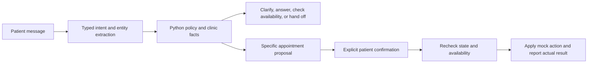

# Approach and technical decisions

## A constrained agent workflow

The LLM handles linguistic variation. Deterministic code handles authority and side effects. A small, explicit workflow is easier to test and explain than an open-ended tool-calling loop for six bounded clinic intents. The model cannot access the mutation methods. Actions are represented by real mock-tool results in the decision record.

## Intent, entities, and prompting

The default Gemini interpreter returns a Pydantic `Extraction`: intent, doctor, requested date/time, original appointment date, appointment reference, a hold flag, and an ambiguity flag. The optional OpenAI adapter uses the same contract. The prompt distinguishes a booking enquiry from an availability question and the original date from the destination when moving a visit. Missing fields stay null. It preserves “4” so the backend can ask for am/pm, and “after 5 pm” so availability uses a range rather than an invented exact time.

The prompt treats patient messages and conversation history as untrusted data. It includes the assessment’s difficult cases, but cannot itself guarantee resistance to every adversarial phrase. The structural protection is that **no chat response can execute an appointment mutation**. Even a plausible but incorrect extraction must pass validation and a patient-visible proposal.

The default `gemini-3.5-flash-lite` has a documented free tier and completed the live booking/reschedule/cancel conversation. The earlier 2.5 Flash model rejected this new account, and 3.6 Flash later returned repeated HTTP 503 high-demand errors. These observations motivated an explicitly configured model change; there is no automatic model fallback. No broad model or latency comparison is claimed.

The REST adapter requests schema-constrained JSON, validates every field locally, and includes at most eight history messages. It uses a 20-second request budget and at most one additional attempt, after one second, for HTTP 502/503/504 when time remains. Quotas, access failures, timeouts, and invalid output are not automatically retried. A shared cooldown limits bursts and expands after quota errors. Safe categories distinguish daily limits, temporary rate limits, HTTP failures, timeouts, connection failures, and invalid output without revealing provider bodies or credentials. Billing is controlled by the Google project, not the model name in code.

The offline interpreter is a transparent baseline: regular expressions, a few common spelling corrections, and conservative clarification. It supports the supplied English examples and common follow-ups. It is not a replacement for evaluating the real model on representative messages.

## Why this does not use RAG

The assessment provides bounded clinic actions backed by a small structured mock directory and schedule. Direct tool queries return the required facts. A vector database would add retrieval uncertainty without a document corpus to justify it. If the product later includes clinic policies or patient instructions as documents, a separate retrieval step with citations could support those questions. Availability and appointment mutations would still use the scheduling service.

## Missing and ambiguous information

Compatible follow-ups fill the active draft. A changed intent starts a separate request rather than inheriting unrelated appointment details. The backend validates doctors against the configured directory, identifies an existing visit in the current sample session, resolves dates in `Asia/Beirut`, and checks a fictional schedule.

An existing-visit search matches a bare weekday against the actual stored visits, including a visit next Monday when today is Monday. One match can be used directly. Multiple matches are listed with their doctors and full dates/times, and the patient can answer with a doctor, time, or list position. These selection details identify the original visit; they do not replace the requested rescheduling destination. A reference is also accepted, and a reference reply clears stale search criteria. Holds survive clarification, and every change still requires confirmation.

Greetings, incomplete single-character input, bounded appointment-selection replies, and explicit doctor/date/time details within an understood request are handled locally and labeled as local routing. They consume no provider requests. Compound and free-form requests still use Gemini. Saying hello preserves the active draft while invalidating any previous confirmation, as every new message does.

After a provider failure, the old proposal is invalid and the draft is suspended. The user can explicitly retry the failed message; that retry restores previously validated details and reprocesses the message. A different new request cannot silently inherit the suspended draft. The Retry button uses a new request ID, while transport-level retries retain their ID for idempotency. A successful retry still needs a new, exact confirmation before changing a visit.

For a new appointment or rescheduling destination, an unqualified weekday means its next occurrence, including today. “Next Wednesday” means Wednesday in the following calendar week. “Next week” searches Monday through Saturday of the following week. Explicit past dates and dates beyond the 90-day demo horizon are rejected. Numeric dates with ambiguous month/day order require clarification. Two-digit `HH:MM` is treated as 24-hour time; bare hours 1–12 require am/pm. All selected slots are displayed as a full calendar date before confirmation. Existing-visit selection also accepts numbered list positions; an explicit time such as “10 am” identifies a time rather than a list position.

Vague phrases such as “my doctor” never imply access to a medical record. Unknown doctors, conflicting options, unsupported time ranges, and unmatched appointment references produce questions. The mock patient is preselected so the assessment can demonstrate changes without adding a login system.

## Avoiding incorrect actions

- Every appointment mutation requires an opaque token tied to the current proposal, session, operation, and exact slot.
- Every new message invalidates the previous proposal. Free-text “yes” cannot confirm it.
- “Don’t book yet” and similar holds prevent a proposal; explicit holds are also checked against raw English text independently of the model.
- Proposals expire after ten minutes. Confirmation rechecks the schedule and patient conflicts.
- Per-session locks make rescheduling an atomic update, preserving the appointment reference. Messages and confirmations are idempotent by request ID. Reusing an ID with a different payload is rejected.
- Existing records must belong to the current sample session. Separate sessions simulate separate patients and separate clinic sandboxes.
- Responses are assembled from validated facts and actual execution results. A mock handoff never promises a real callback. Recognizable handoff and clinical requests can be routed locally during a provider outage.

## Interface decisions

The conversation sits beside the appointment list so patients can refer to existing visits while typing. The decision inspector is available on demand. Native buttons, labeled inputs, keyboard submission, modal dialogs, reduced-motion support, and a collapsible mobile appointment list support usability. Fonts are bundled locally.

## What production would need

This local assessment intentionally uses ephemeral process memory, not a real clinic integration. Sessions expire after two hours and have bounded request counts; restarting the server discards them. The browser stores only the opaque session identifier in tab-scoped session storage. This identifier is a demo bearer capability, **not authentication**.

Before real use: authenticate and authorize patients; use a persistent appointment service with transactional slot locking across all patients; integrate an actual handoff queue; add durable idempotency, audit events, consent and retention policies, rate limiting, observability, and secrets management. Add clinician-reviewed emergency routing, multilingual evaluation, and real holiday/provider schedules. Do not treat a short keyword list as medical triage.

Evaluate intent accuracy, entity correctness, unnecessary clarification, unsafe proposal rate, unauthorized mutation rate, completion rate, latency, and cost on a held-out set with multi-turn and adversarial cases. Review failed transcripts; compare candidate models before choosing one. A claim of medical, security, or privacy compliance is outside this prototype’s evidence.

## References

- [Gemini structured outputs](https://ai.google.dev/gemini-api/docs/structured-output): schema-constrained model output and local validation requirements.
- [Gemini generateContent reference](https://ai.google.dev/api/generate-content): REST request and candidate response contract.
- [Gemini pricing](https://ai.google.dev/gemini-api/docs/pricing) and [billing](https://ai.google.dev/gemini-api/docs/billing): free-tier model availability, quotas, and project billing.
- [OpenAI Structured Outputs](https://developers.openai.com/api/docs/guides/structured-outputs): schema-constrained extraction and Python parsing.
- [GPT-4.1 mini model documentation](https://developers.openai.com/api/docs/models/gpt-4.1-mini): supported API features.
- [FastAPI testing](https://fastapi.tiangolo.com/tutorial/testing/): request-level tests with TestClient.
- [Vite getting started](https://vite.dev/guide/): React development tooling and runtime requirements.
