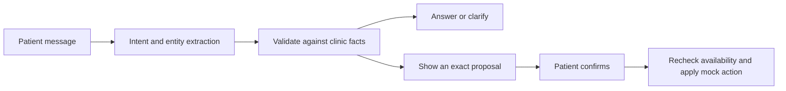

# Part 1 · Approach

The assistant uses an LLM to interpret messages and Python to validate requests, query the mock schedule, and apply confirmed changes. This keeps flexible language understanding separate from appointment state.

## Intent and structured information

Gemini returns a Pydantic `Extraction` containing the intent, doctor, preferred date/time, original appointment date, reference, and hold/ambiguity flags. Missing fields stay null. The prompt separates the original and destination dates in a rescheduling request and preserves ambiguous times such as “4” for clarification.

The configured model is `gemini-3.5-flash-lite`. It completed the recorded live conversation; earlier 3.6 Flash requests encountered repeated service errors. This is a tested configuration for the assessment, not a broad model comparison. The optional OpenAI adapter uses the same extraction contract but has only been tested with a mock client.

The model receives the active draft and at most eight recent messages as untrusted data. Schema-constrained output is validated locally. It has no booking tools and does not generate claims about completed actions. Python builds responses from clinic facts and actual mock-tool results.

The offline rule interpreter is an explicitly selected baseline. Greetings, explicit handoff requests, and bounded clarification replies can also be handled locally in Gemini mode. Free-form messages still use the configured model; failures never switch providers automatically.

## Clarification and conversation state

Compatible replies fill the current draft. A different intent starts a new request. Doctors must match the directory; dates use `Asia/Beirut`; slots must exist in the mock schedule.

For “Move my appointment from Monday to Wednesday,” Monday identifies the existing visit and Wednesday identifies the destination. A bare original weekday is matched against stored appointments. If two visits match, the assistant lists their doctors, dates, and times. A doctor name, time, list position, or reference can select one. Selection preserves the requested destination and never changes an appointment by itself.

Bare hours 1–12 require am/pm, while two-digit `HH:MM` is treated as 24-hour time. An unqualified destination weekday means its next occurrence, including today; “next Wednesday” means the following calendar week. “Next week” searches Monday through Saturday. Past dates, ambiguous numeric dates, and dates beyond the 90-day sample schedule require correction. Full dates and times appear before confirmation.

“My doctor” does not identify a doctor or imply access to a medical record. Missing information produces a question. Conflicting alternatives require a single choice. Requests such as “don’t confirm anything yet” remain on hold through subsequent clarification.

## Preventing incorrect changes

- Messages can query or prepare a proposal; only the separate confirmation endpoint can mutate appointments.
- Each confirmation token belongs to one session and exact proposal. A new message invalidates the old token, and proposals expire after ten minutes.
- Confirmation rechecks availability and conflicts. Rescheduling retains the appointment reference; cancellation requires an active visit in the same session.
- Per-session locks serialize changes. Request IDs prevent duplicate execution; reusing an ID with a different payload is rejected.
- Holds are checked against both extracted fields and raw English text. Free-text “yes” does not confirm a visit.
- Handoffs are mocked and explicitly say that no real call is triggered. Medical requests are directed to qualified help without a diagnosis.

On a provider failure, the proposal is invalidated and earlier details are suspended. **Retry message** restores those details only for the failed message; a different request cannot inherit them silently. Quota, timeout, connection, and setup errors have separate messages. The adapter makes at most one additional attempt for HTTP 502/503/504 within its request budget; quotas and invalid outputs are not automatically retried.

## Tools and interface

The schedule and doctor directory are structured mock data, so direct function calls provide the required facts. There is no document corpus to justify RAG. A future clinic-policy document collection could use retrieval with citations, while scheduling would continue to use authoritative API data.

React displays the conversation beside existing visits. The decision inspector exposes structured fields, checks, the next action, and mock-tool results. The interface supports keyboard submission, dialogs, reduced motion, and a collapsible mobile appointment list. Fonts are bundled locally.

## Production changes

Sessions and appointments currently live in process memory and reset on restart. Each session is a separate sample clinic; the session identifier is not patient authentication. No real calendar, notification service, or medical record is connected.

A deployed clinical product would need patient authentication and authorization, persistent storage, transactional slot locking across patients, durable idempotency, an actual handoff queue, audit records, rate limits, and privacy controls. Clinical escalation rules would need qualified review. Evaluation should cover multilingual and adversarial messages, clarification and completion rates, incorrect proposals, unauthorized changes, latency, and cost on a separate test set.

See the [validation record](validation.md) for measured results and known gaps.

## References

- [Gemini structured outputs](https://ai.google.dev/gemini-api/docs/structured-output)
- [Gemini generateContent API](https://ai.google.dev/api/generate-content)
- [FastAPI testing](https://fastapi.tiangolo.com/tutorial/testing/)
